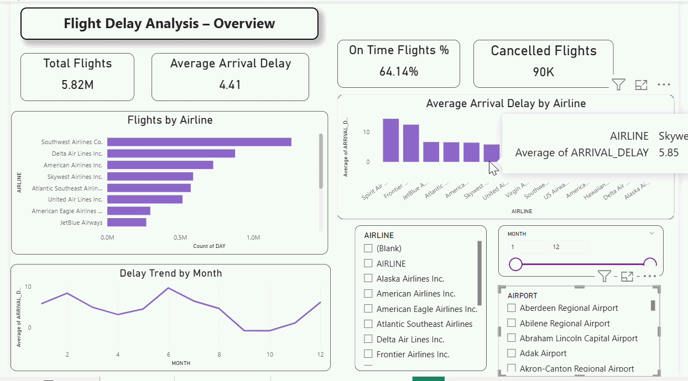
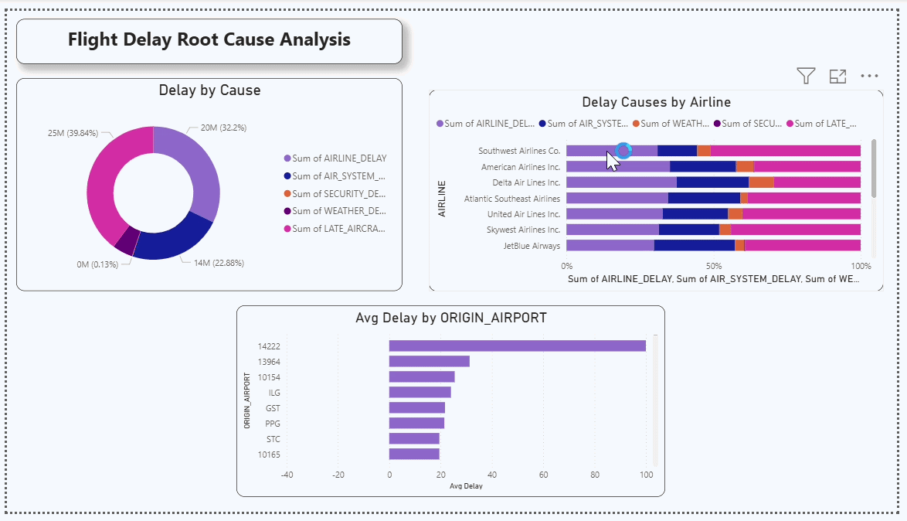
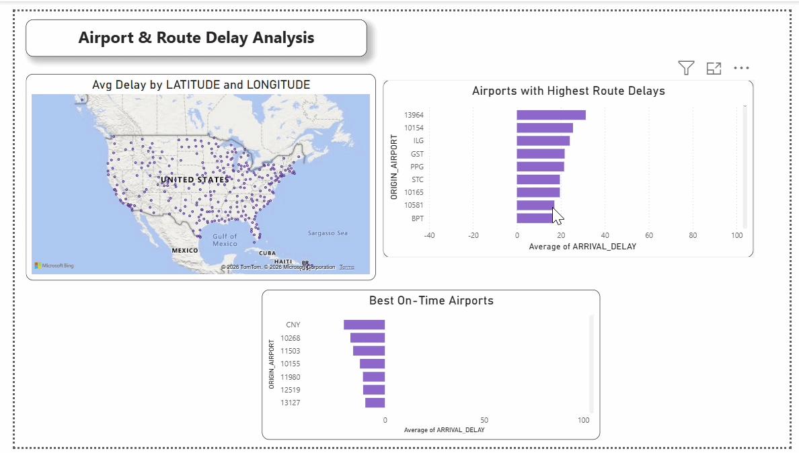

# ✈️ Airline Delay Analysis – Power BI

## 📌 Project Overview
This project presents an interactive **Power BI dashboard** built to analyze airline flight delays across the United States.  
The dashboard explores delay patterns, root causes, airline performance, and airport-level insights to understand operational inefficiencies and improve decision-making.

📂 **Dashboard File:**  
[Airline_Delay_Dashboard.pbix](Airline_Delay_Dashboard.pbix)

---

## 🎯 Project Objectives
- Analyze overall flight performance and delay trends  
- Identify key causes of flight delays  
- Compare airline performance based on delays  
- Evaluate airport-level delay patterns and route efficiency  

---

## ▶️ How to Use This Dashboard
1. Download the `.pbix` file from the repository  
2. Open it using **Power BI Desktop**  
3. Use slicers and filters to explore airline performance, delay causes, and airport trends interactively  

---

## 📄 Page 1: Overview
This page provides a high-level summary of airline performance and delay statistics.

### 🔍 What this page shows:
- Total number of flights  
- Average arrival delay  
- On-time performance percentage  
- Total cancelled flights  
- Flight distribution across airlines  
- Monthly delay trends  

---

## 📄 Page 2: Delay Analysis
This page focuses on understanding the **root causes of delays** and how they vary across airlines.

### 🔍 What this page shows:
- Distribution of delays by cause (Weather, Carrier, NAS, Security, Late Aircraft)  
- Delay contribution across airlines  
- Airports with highest average delays  
- Comparative analysis of delay types across airlines  

---

## 📄 Page 3: Airport & Route Analysis
This page highlights geographical patterns and identifies high-delay airports and routes.

### 🔍 What this page shows:
- Geographic distribution of delays using map visualization  
- Airports with highest route delays  
- Best performing (on-time) airports  
- Route-level delay insights  

---

## 🛠️ Skills Showcased
This project demonstrates practical application of **data analytics and Power BI concepts**:

⚙️ **Data Cleaning & Transformation (Power Query)**  
- Processed raw flight datasets  
- Handled missing values and structured data  
- Built relational data model (flights, airlines, airports)  

🧮 **Measures & KPIs (DAX)**  
- Created KPIs like total flights, average delay, on-time %  
- Built calculated measures for performance analysis  

📊 **Data Visualization**  
- Used Bar Charts, Line Charts, Donut Charts, and Maps  
- Designed visuals to highlight trends and comparisons  

📌 **KPI Cards & Reporting**  
- Built summary cards for key metrics  
- Designed structured dashboard layout  

🖱️ **Interactive Dashboarding**  
- Implemented slicers (Airline, Airport, Month)  
- Enabled cross-filtering for deeper insights  

🎨 **Dashboard Design & Storytelling**  
- Structured dashboard into 3 analytical pages  
- Focused on clarity, usability, and business insights  

---

## 🚀 Key Insights
- Airline delays are primarily driven by carrier and late aircraft issues  
- Certain airlines consistently show higher delay patterns  
- Seasonal trends indicate peak delay periods during specific months  
- Some airports show significantly higher delays due to congestion and traffic  

---

## 📌 Note
Due to size constraints, the dataset is not included in this repository.

---

## 👩‍💻 Created By
**Madhu Shree**
